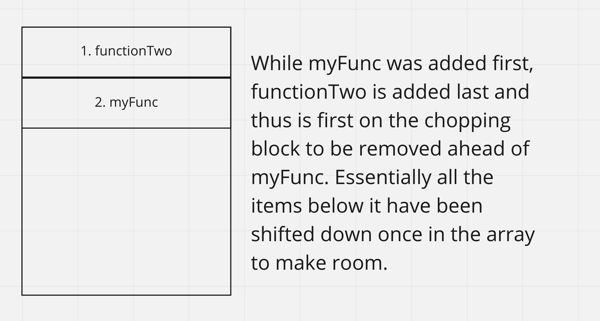

# Reading Notes 10

[Back to the table of contents](../../README.md)

## Reading 1

* What is a ‘call’?
  * A call is a single function in the last in first out list that is the call stack. The call stack is a list of functions waiting to resolve because they are waiting on the return value of a function called inside itself. So for example, if you have a function, and then in that function you call a toUppercase, your stack will now have two levels deep while it is in toUppercase because it is processing that function and then will go back to the lower level one with the result of toUppercase to continue. If toUppercase errored, the call stack would show two levels of depth.
* How many ‘calls’ can happen at once?
  * As many as the browser can accomodate. In essense, it doesn't really matter since the browser WILL accomodate for you, except for situations you make a stack overflow happen. Will talk about that in its own section.
* What does LIFO mean?
  * I mention it above, Last In, First Out. It's a data structure that means a list of data will have the last thing added to it as the first thing removed. So using my previous example, the stack is empty, then has my function, then has toUppercase, then removes toUppercase when its done, then removes my function when that is done as well.
* Draw an example of a call stack and the functions that would need to be invoked to generate that call stack.
  * Going to use a code block for the functions:
```js
function myFunc() {
  functionTwo();
};

function functionTwo() {
  throw new Error('Die!');
}
```
  * And how the stack trace would look:
    * 
* What causes a Stack Overflow?
  * The point where your browser can't keep adding calls to the call stack. The only situation that really comes up in is when you accidentally add a recursive loop that adds to the call stack, aka a function that calls itself. It will keep calling itself, but never finishing what it calls because it goes deeper to run itself again, so on and so forth until the browser has had enough with you and stops the code from running with a stack overflow error.

# Reading 2

* What is a ‘reference error’?
  * Thrown when you try to reference something that doesn't exist.
* What is a ‘syntax error’?
  * Thrown when you write nonsensical syntax, however that happens. Triggers from unbalanced (), [], {}, incorrect use of operators, and pretty much every other way you can muck up writing code.
* What is a ‘range error’?
  * A bad length set to any object that has length (Like Arrays). It can trigger from overflowing your stack as well, because the length gets to be too large.
* What is a ‘type error’?
  * The most common kind of error in javascript created because javascript doesn't enforce type. Because it is expecting you to be good about that rule, if you try to access things on data types that should not have values to access, it will error. For example, on an empty object you can try accessing anything- it'll just always be undefined. If you try to access anything from anything you accessed, you're essentially calling undefined.key, which is messed up. TypeError your way!
* What is a breakpoint?
  * Breakpoints are little markers you can put in your code to denote when the code execution should freeze. Why is this useful? Well, it lets you pick points to pick around at local variables and better debug what is going on with your code.
* What does the word ‘debugger’ do in your code?
  * Debugger is a keyword for placing a breakpoint. I wouldn't ever use it, just set markers in vsc or in browser. But yes, I suppose if you want to breakpoint that way it will work.
